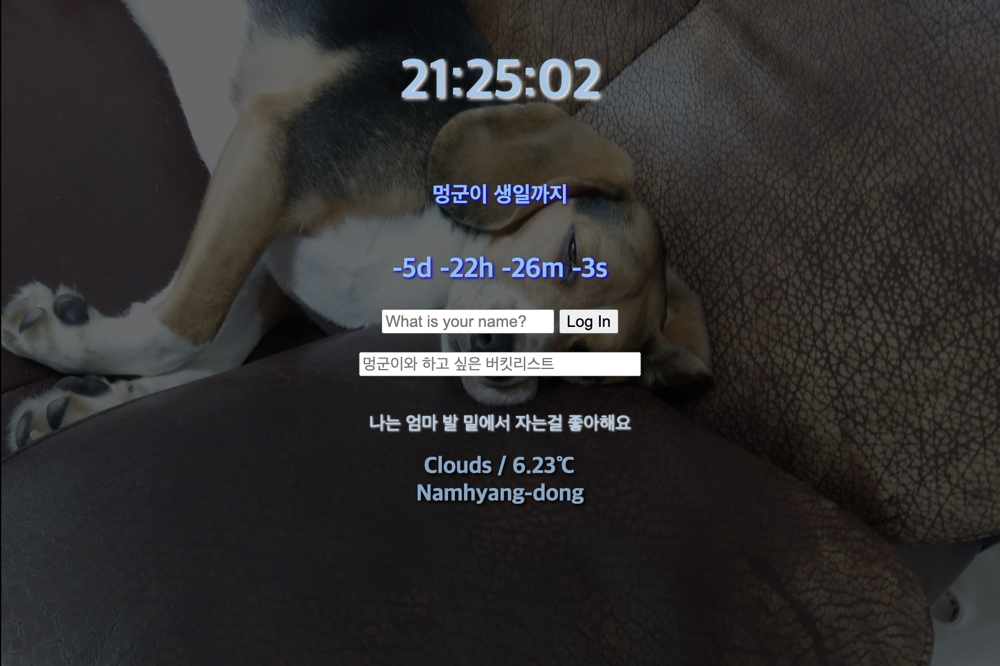

# Chrome Web with Vanilla JS

<p align="center">

</p>

## Chrome Web
> 개발 기간 : 2023.03.20-2023.04.02
## Deploy
> https://yun0727.github.io/Vanilajs_final/

<br/>

# Guide

### Installation
```
$ git clone https://github.com/yun0727/Vanilajs_final.git
```

<br/>

# Stacks
### Environment


### Development


### Deploy


<br/>

# 주요 기능
* 자바스크립트로 시계, 할일 목록, 날씨 구현
* Open Weather API를 사용하여 위치 정보와 날씨 정보 불러오기
